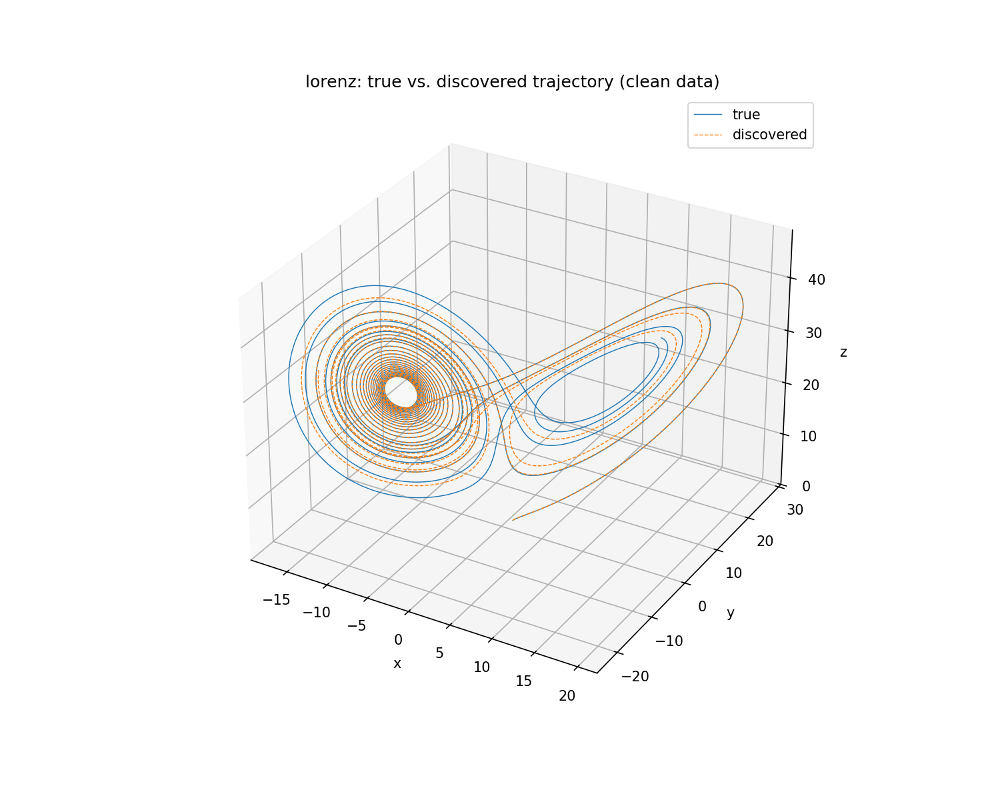

# sindy-torch

An implementation of **SINDy** (Sparse Identification of Nonlinear Dynamics;
Brunton, Proctor & Kutz, *PNAS* 2016) in PyTorch, built from scratch — no
`pysindy` dependency. Given nothing but a trajectory sampled from a
dynamical system, it rediscovers the differential equations that generated
it.

## The idea

Most physical laws, once written in the right coordinates, are governed by
only a handful of terms — that sparsity is the whole trick. SINDy turns
"find the equations" into a regression problem:

1. Build a library of candidate nonlinear functions of the state,
   `Theta(X)` — constants, polynomials, trig terms, whatever you think might
   plausibly appear.
2. Assume the true dynamics are a *sparse* linear combination of those
   candidates: `Xdot = Theta(X) @ Xi`, where most entries of `Xi` are exactly
   zero.
3. Solve for `Xi` with a sparsity-promoting regression — here, sequentially
   thresholded least squares (STLSQ): fit by ordinary least squares, zero
   out any coefficient below a threshold `lambda`, refit on the survivors,
   and repeat until the active set stops changing.

Because the library is overcomplete (far more candidate terms than the true
equations use), an unregularized fit would happily assign small nonzero
weight to every column. STLSQ's iterative hard-thresholding is what forces
the fit back onto a small, physically-interpretable set of terms — assuming
the true dynamics are in fact expressible in the given library and lambda is
tuned to sit between the true coefficients' magnitudes and the regression's
noise floor.

## Headline demo: recovering Lorenz from clean data

```
$ python3 scripts/experiment_clean.py --system lorenz

true equations:
  dx/dt = -10.000 x + 10.000 y
  dy/dt = 28.000 x - 1.000 y - 1.000 x z
  dz/dt = -2.667 z + 1.000 x y

discovered equations:
  dx/dt = -10.00 x + 10.00 y
  dy/dt = 28.00 x - 1.00 y - 1.00 x z
  dz/dt = -2.67 z + 1.00 x y

coefficient error: frobenius_rel=6.40e-05, max_abs=1.95e-03,
support recovered exactly for 20/20 terms (7 true nonzero terms)
```

Exact support recovery, coefficients accurate to ~1e-3, from data alone.



The two trajectories track closely at first and separate on the right lobe
later in the run — expected chaotic (Lyapunov-time) divergence from tiny
coefficient error compounding, not evidence the model is wrong. Coefficient
accuracy, not trajectory overlap at long horizons, is the right thing to
judge a chaotic system's discovered model on.

## Pipeline / how to run

```bash
pip install -r requirements.txt
python3 scripts/experiment_clean.py --system lorenz
```

or

```bash
./reproduce.sh
```

That one script runs the entire discovery pipeline end to end:

| Step | Module | What happens |
|---|---|---|
| 1. Simulate | [`src/systems.py`](src/systems.py) | Integrate a known system (Lorenz / Van der Pol / Rössler) with SciPy's adaptive RK45 to get a trajectory `X`. |
| 2. Estimate derivatives | [`src/derivatives.py`](src/derivatives.py) | Estimate `Xdot` from `X` — finite differences on clean data, Savitzky-Golay for noisy data. |
| 3. Build the library | [`src/sindy.py`](src/sindy.py) (`FeatureLibrary`) | Evaluate `Theta(X)`: constant, polynomial terms up to `--poly-degree`, optional trig terms. |
| 4. Solve (STLSQ) | [`src/sindy.py`](src/sindy.py) (`stlsq`) | Sparse-regress `Xdot = Theta(X) @ Xi` down to a handful of active terms. |
| 5. Compare & visualize | [`src/evaluate.py`](src/evaluate.py) | Pretty-print discovered vs. true equations, compute coefficient error, integrate the discovered model and plot it against the true trajectory. |

To try a different system or tune the regression:

```bash
python3 scripts/experiment_clean.py --system van_der_pol
python3 scripts/experiment_clean.py --system rossler
python3 scripts/experiment_clean.py --system lorenz --poly-degree 4 --threshold 0.2 --dt 0.0005
```

`scripts/demo_library.py` is a smaller script that only exercises steps 1
and 3 (simulate + build the library), useful for inspecting `Theta(X)`
without running the full regression.

## The derivative-noise limitation

**Derivative noise is SINDy's main failure mode**, more so than the choice
of library or threshold. `Xdot` is never observed directly — it has to be
estimated from `X` — and differentiation is an ill-posed operation on noisy
signals: a finite-difference estimate divides a noise-sized numerator by a
small `dt`, amplifying measurement noise rather than suppressing it. Once
the derivative estimate is corrupted, STLSQ cannot tell a real small-
coefficient term from a term that's really just curve-fitting derivative
noise — it will happily "discover" spurious terms, or threshold away real
ones, depending on where `lambda` sits relative to that noise floor.

- `src/derivatives.py::finite_difference` — central differences, correct
  choice for clean/near-noiseless data, but unusable once measurement noise
  is present.
- `src/derivatives.py::savgol_derivative` — Savitzky-Golay: fits a local
  polynomial in a sliding window and differentiates it analytically,
  smoothing and differentiating in one step. The window length trades bias
  (too wide, flattens real fast dynamics) against variance (too narrow, lets
  noise through) — there's no universally correct default, it has to be
  tuned against the actual noise level.

`experiment_noisy.py` (not yet built) will sweep measurement-noise levels
and plot recovered-coefficient error vs. noise — the point at which
discovery breaks down.

## Repo layout

```
src/
  systems.py       known dynamical systems (Lorenz, Van der Pol, Rossler)
  derivatives.py   derivative estimators (finite difference, Savitzky-Golay)
  sindy.py         feature library (Theta) + STLSQ solver
  evaluate.py       equation printing, coefficient comparison, trajectory plotting
scripts/
  demo_library.py       simulate + build Theta(X), no regression
  experiment_clean.py   full pipeline on clean data
tests/
  test_smoke.py    fast end-to-end check: recovers dx/dt = -x
```

## Status

Done: simulators, feature library, STLSQ, clean-data recovery experiment,
smoke test. Not yet built: the noisy-data experiment / noise-sweep plot.
